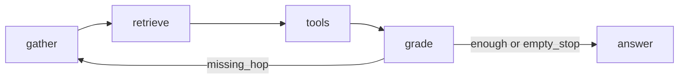

# Knowledge retrieval and question answering

An agent that indexes a news corpus, exposes a small retrieval tool surface, and answers 11 questions with grounded citations or an explicit refusal. `pyproject.toml` requires Python `>=3.12,<4.0`.

This directory is the assignment package: `solution.py`, `pyproject.toml`, source data under `src/data/`, and generated answers under `output_for_mission/`.

## Quickstart

Install [uv](https://docs.astral.sh/uv/getting-started/installation/). From this `project` directory:

```bash
cp .env.example .env
```

Set `OPENAI_API_KEY` in `.env`. Defaults already point at OpenRouter and at the models used in the recorded run. Do not put a key in any committed file.

```bash
uv sync
uv run python solution.py
```

That command loads `.env`, rebuilds the Facts Chroma index from `src/data/` (`build_index`), calls `answer` once per row in `src/data/questions.json`, and writes `output_for_mission/answers.json` and `output_for_mission/transcripts.json`. `build_index` always re-embeds the facts (and the source catalog); it does not skip an existing `output_for_mission/facts_chroma` directory.

Missing required environment variables fail at runtime without printing the secret.

| Variable | Role |
| --- | --- |
| `OPENAI_API_KEY` | API credential (OpenRouter or compatible) |
| `OPENAI_BASE_URL` | OpenAI-compatible base URL |
| `OPENAI_EMBEDDING_MODEL` | Embedding model for index and query |
| `OPENAI_GATHER_AGENT_MODEL` | Decompose into standalone sub-questions |
| `OPENAI_GRADE_AGENT_MODEL` | Stop vs another hop |
| `OPENAI_ANSWER_AGENT_MODEL` | Answer or refuse from this-run evidence |
| `OPENAI_RETRIEVE_AGENT_MODEL` | Fill `search_facts` arguments |

`solution.py` exposes the harness contract: `build_index(data_dir) -> object` returns an opaque Facts-index handle; `answer(index, question_id, question) -> dict` returns `{ "answer": str, "citations": [ { "article_title": str, "snippet": str } ] }`.

| File | What it is |
| --- | --- |
| `output_for_mission/answers.json` | 11 public answers and citations |
| `output_for_mission/transcripts.json` | Gather / retrieve / tool / grade / answer turns |
| `pyproject.toml` | Dependency manifest (`uv sync`) |

At answer time the loop never reads `corpus.json` or `facts.json` into the prompt. Knowledge arrives only through the bound `search_facts` tool.

## Selected inputs

Both `facts.json` and `corpus.json` are used at index time. Facts are validated against corpus titles, then stored as the only retrieval collection `build_index` builds. Answer-time retrieval uses **Facts only**.

Facts are already one sentence, aligned to `article_title` / `url` / `published_at`, and cheap to rank. On this 11-question set, gold evidence for answerable items is in Facts; Q04 and Q09 have no supporting facts. Binding corpus passages in the loop would add nearest-passage noise without a gold sentence, so `search_corpus` is implemented but not allowlisted.

The public `answer` dict copies only `article_title` and `snippet`. Retrieved items also carry `url` and `published_at` for filtering, Answer’s clock, and citation grounding.

## Retrieval layer

The unit of retrieval is a curated fact sentence in a local Chroma collection (`output_for_mission/facts_chroma`), with cosine embeddings from the configured OpenRouter model (default `nvidia/nemotron-3-embed-1b:free`). Each record stores the fact text as the document plus `article_title`, `source`, `url`, `published_at`, and `published_at_epoch`. That is enough for entity mentions (in the sentence), cross-article hops (several facts, different URLs), and time (filter and compare dates). A knowledge graph was not worth a second representation on this set.

Chroma is local, persistent, and supports metadata filters. LanceDB was considered for table-shaped data; the need here is a small embedded vector store, not analytics.

Query text is embedded once per `search_facts` call. Optional inclusive `published_from` / `published_to` filter on `published_at_epoch` before ranking (date filter, not chronological sort). Optional `source` is resolved against a catalog written at index time: exact name, then unique substring, then nearest catalog embedding with a similarity floor and a margin over the runner-up. Unresolved names drop the source filter rather than guessing.

Shipped ranking: `RETRIEVAL_TOP_K=1`, no Facts cosine drop floor, no reranker. Top-5 plus a Facts floor threw weak gold (similarity in the mid-20s to low 30s). A free reranker was not a confidence score and moved gold down. Collapsing by URL deleted distinct sentences from the same article. Every answerable gold is already rank 1 of *its* hop, so the union does not need a second ranker. Unanswerable hops still return the nearest sentence; dropping those by cosine would also drop weak gold. That leftover is for Answer, not a retrieval cutoff.

`match_percentage` is cosine similarity × 100. Status `ok` / `low_confidence` / `empty` / `invalid` is a retrieval diagnostic. Answer sufficiency is judged from the evidence list, not from a second numeric cutoff.

Experiment log: `plans/pda-knowledge-retrieval-assignment/TASK-03-decisions.md`.

## Tool surface

Two typed tools exist in `src/tools/retrieval_tools.py`: `search_facts` and `search_corpus`. The answering loop binds only `search_facts`. Arguments are `question` plus optional inclusive dates and optional `source`. There is no article-by-title tool, no MCP, and no extra filters (`limit`, category, entity, pagination). `RETRIEVAL_TOP_K` already bounds the context; extra knobs are easy for a model to set wrong and look like “no evidence”.

Each call returns `status`, the query, and a bounded citation-ready `results` list. `RetrievalTools.as_langchain_tools()` wraps the instance method so Chroma paths, `task_data`, and `flow_id` never enter the LLM schema.

## Agent loop

Answering is a LangGraph loop, not a single LLM call over pre-fetched hits. `src/orchestration/grounded_answering_workflow.py` owns budgets and stop conditions.



- **Gather** (`src/agents/gather_agent.py`) has no tools. It emits standalone sub-questions. One agent that both decomposed and filled `source` leaked outlet names across hops (Q05). Split that job.
- **Retrieve** (`src/agents/retrieve_agent.py`) sees one sub-question, is bound to `search_facts`, and fills `source` / dates. `tool_choice` is `search_facts`; the model chooses arguments, not a second tool.
- **Grade** (`src/agents/grade_agent.py`) has no tools. `missing_hop` continues gathering; `enough` and `empty_stop` go to Answer.
- **Answer** (`src/agents/answer_agent.py`) has no tools. It claims or refuses from this-run evidence only.

Gather uses `openai/gpt-4.1` because weaker models leaked `source` across claims. Grade uses `openai/gpt-4.1-mini`. Retrieve and Answer stay on `openai/gpt-4o-mini`. Prompts live in `src/prompts/`; they do not contain evaluation questions.

The loop stops when Gather emits no sub-questions, Retrieve emits no tool calls, Grade stops, or orchestration hits 6 gather LLM turns or 5 tool calls. Then Answer runs. A non-refusal answer must copy supporting `snippet` and `url` verbatim; orchestration keeps a citation only when both match an evidence item from that run.

Experiment log: `plans/pda-knowledge-retrieval-assignment/TASK-04-decisions.md`.

## How refusal works

The public refusal string is exactly `Insufficient information`. An empty `answer` from the loop is rewritten to that string at the `solution.py` boundary.

Answer sees only this-run evidence (Top-1 Facts hits). It refuses when that list is empty or a needed fact is missing. A supported `No` is an answer, not a refusal.

If the model marks `answered` but no citation survives the snippet/url check, or it already marked `refused`, the run is coerced to `refused` and `citations` is cleared. The assignment allows leftover citations on a refusal; this implementation does not keep them.

Q04 and Q09 have no supporting facts. Retrieval still returns a nearest sentence. Refusal on those questions is Answer’s job, not a retrieval floor.

## Known failure modes

**Q09 extra hops.** Grade can ask for another hop after the first batch. Live end-to-end scores that as a late stop. The public answer is still `Insufficient information`.

## Working at 100× scale

At ~25k facts, a local Chroma/SQLite store plus a process lock on queries cannot serve parallel hops. Replace it with a vector index that allows concurrent queries.

A full rebuild would embed ~100× more records. Do it in batches off the request path, not as one synchronous `build_index` on a free-tier embedding model.

Top-1 cosine per hop gets noisier as the store grows. Add lexical or hybrid search (or a bounded Top-k), not a single nearest fact.

## What I'd do with two more days

- Cut end-to-end latency (fewer serial waits, less extra Grade looping).
- Retry Gather / Grade / Retrieve / Answer on cheaper or `:free` OpenRouter models and keep a candidate only if live quality holds.
- Write additional ground-truth questions on the same corpus, not the current 11, so prompts are not tuned to one exam set.
- Browse existing local logs and OTLP JSONL through the HTML dashboard instead of raw files.

## Cost-aware LLM usage

The assignment budget is $2. Chat for the 11 recorded questions is about **$0.023** (dashboard rate table, not an OpenRouter invoice): Gather ~$0.015, Grade ~$0.004, Answer ~$0.002, Retrieve ~$0.002. Mean ~$0.002 per question; Q09 is the expensive one because Grade kept looping.

Embeddings on that pass used the free Nemotron model. There is no reranker and no `search_corpus` in the loop. Index text is not pasted into prompts. Answering embeds the hop query only; `solution.py` also re-embeds Facts on every `build_index`.

Cheap/free models are the default for embeddings. Chat stays on small OpenAI slugs that reliably support structured output and tool calls. Flagship models are not used.

## Rebuild from scratch

Copy `.env.example` to `.env` and set `OPENAI_API_KEY`. The other variables can stay at the example defaults.

From the `project` directory:

```bash
uv sync
uv run python -m src.services.facts_chroma_index_service
```

`solution.py` only needs the Facts store. `corpus.json` is still required as input so every fact title exists in the corpus. To rebuild the unused passage store as well:

```bash
uv run python -m src.services.corpus_chroma_index_service
```

Generated Chroma files are local artifacts. The committed scripts, source JSON, lockfile, and manifest fingerprints are enough to reproduce the same logical records. Physical SQLite/HNSW files are not byte-for-byte identical, and vectors change if `OPENAI_EMBEDDING_MODEL` changes.
